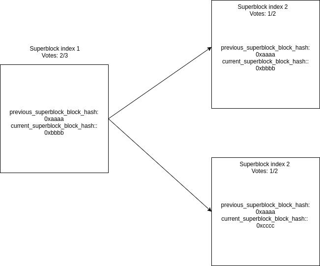
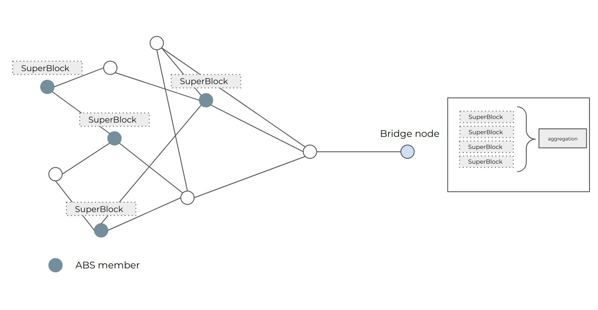

<pre>
    WIP: WIP-0004
    Layer: Consensus (hard fork)
    Title: BLS signature propagation and aggregation
    Authors: Gorka Irazoqui <gorka@stampery.co>
             Claudia Bartoli <claudia@stampery.co>
    Discussions-To: `#dev-general` channel on Witnet Community's Discord server
    Status: Proposed
    Type: Standards Track
    Created: 2020-04-29 
    License: BSD-2-Clause
</pre>

## Abstract

This proposal discusses BLS signature generation, propagation and aggregation in the Witnet network. This is a key feature for the interoperability with Ethereum, in particular to achieve highly efficient signature verifications by leveraging the curves that the EVM subsidizes.

The security of a light client capable of verifying transactions from a side chain is closely related to the consensus protocol of such side chain. In the case of Witnet, such a protocol is based on a reputation system and therefore an attestation of the veracity of block headers is needed by the nodes that hold the majority of such reputation. Veryfing these attestations individually would be highly inefficient in most smart contract platforms. BLS signatures allow us to aggregate these attestations and perform a single verification on the *aggregated attestation*, thus becoming an essential feature to be implemented for a cost-effective interoparibility with smart contract platforms.

## Motivation and Rationale

Implementing one-way decentralized bridges between two chains becomes a task that highly depends on the consensus protocol implemented by the chain whose transactions need to be verified. We will call this chain the *source chain* (i.e. the _Witnet chain_), while the chain in which the transactions are verified will be referred as the *target chain*.

Assuming the availability of the source chain's block headers on the target chain, one can easily verify that a transaction occurred in the source chain. Typically, transactions are grouped in a merkle tree whose root is inserted into the block header. Thus, to prove the existence of a transaction you just need to provide a valid merkle path that evinces that the hash of the transaction was undeniably inserted into the merkle tree at the time the block hash was appended to the source chain.

However, ensuring the availability of the block headers in the target chain is not that straightforward, specially for non-PoW chains. PoW achieves probabilistic finality thanks to the difficulty of reverting a chain with sufficient work on it, a difficulty that is publicly verifiable. In order to validate new block headers from chains whose consensus relies on a BFT algorithm that is based on an intra-chain metric (stake, reputation) the target chain needs to know the previous state of such metrics in the source chain. In the particular case of Witnet, the consensus is dependent on the reputation that node holds, a metric that quantifies the honest participation (i.e., agreeing with the majority) of the nodes in previous data requests. These nodes will be part of a group of members called the Active Reputation Set (ARS). Under BFT assumptions we can expect 2/3 of such nodes to be honest, and therefore a block header validity will likely depend on the ability to demonstrate that those 2/3 agree on a specific value.

The scope of this document is to propose a solution for an efficient verification of the signatures of the ARS members in a smart contract platform like ethereum. BLS signatures allow us to collect signatures of the ARS members and provide an aggregated signature to a smart contract that can be validated with a single verification. Undoubtedly, such signature and aggregation might have severe consequences in the Witnet chain in terms of efficiency and latency. The following sections propose a solution that minimizes both.

## Proposal 

### Actors in the system

This section describes the different actors that will take part on the protocol:

- **ARS members**: Nodes who recently participated in the Witnet protocol and that are representative of the current reputation distribution.

- **Disenfranchised nodes**: Nodes who have participated at some point in the Witnet protocol but that are no longer active.

- **Bridge nodes**: Nodes that are in charge of relaying information from Witnet to Ethereum and viceversa. They do not necessarily to actively participate in the Witnet protocol.

### The protocol

This section defines the responsabilities that each of the aforementioned will have in the protocol.

#### Checkpoint based ARS member voting

As already mentioned before, the ARS is a representation of the current reputation distribution in Witnet. Therefore we can expect at least 2/3s of such group to honestly report the current tip of the *Witnet chain*. However, voting for the tip of the chain in every single epoch might incur in non-affordable computational costs. Therefore, the proposal is to vote at specific checkpoints, i.e., every time *epoch mod superblock_period = 0*. Note that the vote should include information about all the block headers that were consolidated since last *checkpoint*. We will refer to the vote emitted every *checkpoint* as a **superblock**.

Currently a block header in Witnet looks like:

                            Block Header

    Data request root       Tally root     Rest of the transactions root 

In order to construct a **superblock**, the following schema is proposed:

- Nodes compute an ordered merkle root of all block data request roots that were consolidated in the last *superblock_period* epochs.

- Nodes compute an ordered merkle root of all block all tally roots that were consolidated in the last *superblock_period* epochs.

- Nodes compute a merkle tree with the ARS snapshot at the time of proposing the superblock. This will be ordered by their public keys.

```

                                          Superblock

        superblock_dr_root            superblock_tally_root               ARS_root

      dr_root1       dr_root2       tally_root1       tally_root2     pk1          pk2 

```

Note that verifying data request and tally transactions becomes as simple as providing the valid merkle path to the *superblock_dr_root/superblock_tally_root* merkle roots. Identically, proving the membership to the ARS is achieved by again providing a valid merkle path to the *ARS_root*.

#### Anchoring superblocks
In order to implement a BFT protocol in the block relay, we need superblocks to be anchored to each other, in a chain-like fashion. These could be done through:

- Adding a *previous_superblock_hash* field.
- Adding two fields to each superblock, called *last_block_in_previous_superblock*, and *last_block*. The first references to the **hash of the last block that the previous superblock contains**, while the latter refers to the **hash of the last block included by the current superblock**. The following image shows how such an scheme would look like in the block relay.

</img>

The latter option is proposed to be implemented in the Witnet node. The reasons are the following:

- If a node is stopped for some time, anchoring the superblock hashes requires reconstruction of all superblocks that happened during down time. This can incur in computational costs for the node.

- On the contrary, anchoring the last block included by the previous and current superblocks allows us to compute the last superblock even if the node was down for some time. The reason is that the node asks for the blocks in order to synchronize again. Therefore we just need to include the latest information from the latest blocks without the need of computing all intermediate superblocks.

#### Signature aggregation
The aggregation can happen at two different stages in the protocol:

1. The ARS members append their signature to an aggregated signature they receive. The drawback of this option is that ARS members should verify the aggregated signatures to prevent from adding their own signature to an invalid set of signatures.

2. The ARS members just transmit their vote and relay every other ARS members vote. The aggregation this time is in charge of the bridge node, who can easily discard invalid signatures. The drawback of this option is that if the ARS becomes big enough it might flood the network.

</img>

The proposal implements **option 2** due to its similarity with the current way of broadcasting blocks every epoch. The mitigations for the potential flooding the network might suffer are still open to discussion and are out of scope for this proposal.

The bridge node in this case will construct the message for the Block Relay. First it will ask the Witnet node it is connected to for the current superblock and the amount of votes it received. Next, it will aggregate those votes into a single aggreated signature. It will also create a merkle proof demonstrating the belonging of each of the voters to the previous superblock ARS. This message will be transmitted to the block relay, which should verify the merkle proof and implement the GRANDPA protocol, which implementation will be discussed and presented in another Witnet improvement proposal.

The message to be constructed for the block relay thus will have the following structure:

```rust
message BlockRelayMessage {
    struct Superblock;
    BlsSig aggregated_signature;
    BlsPubKey[] voters;
    Hash[] merkle_path;
}
```

It is out of the scope of this proposal how an efficient merkle can be computed. However, we can expect not to provide one merkle path per voter to verify, as they all belong to the same merkle tree and can re-use hashes.

In order to achiveve proper finality in the block relay, ARS members should only cast one vote per checkpoint. Clearly there can not be two superblocks being voted by the same node. However, no penalization mechanisms has been discussed at this point, thus nothing prevents them for doing so. For the moment, a Witnet node could just take one of the votes of such a double-voter. Identically, the Block Relay should store the index of the voters that have already voted should be stored. If another bridge node claims to have another vote from the same voter, the bridge node should discard such vote.

#### BLS associated ARS merkle root
As proposed in Draft [WIP-0003], each of the Witnet nodes should store a mapping where they hold the BLS keys. In this sense, everytime a superblock is created nodes should take this mapping and construct a merkle tree with the ARS members ordered, from left to right, by their reputation score. In the figure below, pk<sub>i</sub> refers the BLS public key of node at position $i$ in a reputation based ranking of the ARS members.

```

                                ARS root

            H1             H2               H3              H4

      pk1       pk2   pk3       pk4   pk5        pk6   pk7       pk8

```

#### Rogue-key attack prevention

Note that with the aforementioned proposal a node could specify a BLS key that essentially looks like P* = P<sub>i</sub> - P<sub>i-1</sub> - ... P<sub>0</sub>. In this case, if such node does not demonstrate (and it does not with the aforementioned proposal) having the private key associated to P*, can convince the block relay that several identities signed a particular message when in reality only the malicious node did.

In order to prevent this, we can make each node demonstrate that they have the secret key associated with the public key. In reality they are already doing this, as they are signing the superblock. However, remember we are in principle not verifying these signatures individually. We have two options in this case then:

- Make the witnet nodes verify an individual signature before accepting a bls-key, incurring in gas cost every time a bls-key is proposed (see [WIP-0003]).

- Add non-linearity to the addition, as proposed in [Boneh](https://crypto.stanford.edu/~dabo/pubs/papers/BLSmultisig.html). This means that the aggregated public key would be P= H(P1)* P1+ H(P2) * P2 +... H(Pn)* Pn and the signature be S= H(P1)* S1+ H(P2) * S2 +... H(Pn)* Sn. In this case, due to the difficulty of deriving a suitable P' that after H(P')P' gives the desired result, the attack is mitigated. In order to add this non-linearity, the bridge node should perform the aggregation of signatures as specified, while the block relay should also verify the against a public key aggregated as specified. One potential improvement would be that nodes construct the ARS merkle root already with H(P<sub>i</sub>) as leaves, offloading the block relay from computing such a hash.

### Specification: Witnet-rust

**Signature manager**

In the *signature manager*, the following methods should be created:

- *create_bls_keys*, which creates the BLS secret and public keys.
- *bls_public_key*, which outputs the bls public key.
- *bls_sign*, which signs a given message with the BLS key.

**Chain manager**

Before mining a block, the mining manager should realize whether the current epoch involves creating a superblock. If so, the mining manager needs to do the following actions:

- 1. Starting from *current epoch -2*, fetch backwards blocks from *superblock_period* epochs. The reason to include the -2 is that the current epoch's block is not included, and the chain has finality one block.
    - 1.1. If no blocks have been proposed, no superblock is created.
- 2. Fetch the latest block hash that was proposed before *current epoch -2 - superblock_period*
- 3. If at least one block has been proposed for those epochs, obtain their dr_merkle_roots and tally_roots.
- 3. Call a *build_superblock* function with both roots and the ARS members as arguments.
- 4. The *build_superblock* function should build a Superblock structure like the one explained below.

The message to be hashed and signed by the ARS members could look something like this:

```rust
struct Superblock {

        ars_merkle_root: Hash
        dr_hash_merkle_root: Hash,
        last_block_in_previous_superblock: Hash,
        last_block: Hash,
        superblock_index: u32,
        tally_hash_merkle_root: Hash,
    }
}
```
where *dr_hash_merkle_root* and *tally_hash_merkle_root* are the merkle roots with all dr/tally roots from all blocks that occurred in the last *checkpoints*. *ars_merkle_root* refers to the merkle root of the ARS members at the current checkpoint, *last_block_in_previous_superblock* refers to the latest block hash proposed before *current epoch -2 - superblock_period* and *last_block* refers to the latest block hash of the blocks included in the current superblock.

The message to be transmitted by the ARS members will be the signature of the hash of the aforementiond superblock, upon verification that they belong to the ARS:

```rust
struct SuperblockVote {
    Bn256KeyedSignature superblock_sig = 1;
}
```

Verifications should not be carried out by Witnet nodes, but rather by bridge nodes. In that sense, with this schema witnet nodes should forward everything superblock message that they receive. The bridge node would discard messages that do not correspond with correct verifications.

In order to avoid flooding the network, we can improve the aforementioned schema by wrapping the superblockVote message into a secp256k1 signature. This signature is verified by every node prior to forwarding of the superblock. Thus, nodes sign first the superblock with the BLS key, and then with the secp256k1 key. In that sense nodes can be sure that the message was forged by a legitimate ARS member. Upon superblock message reception, only if the secp256k1 verification passes (and if the node does not have a valid secp256k1 signature for that member) the superblock signature is forwarded. However, bridge nodes should only aggregate signatures coincident with the superblock hash of the node they are connected to. Therefore, nodes should only store votes that are coincident with their own superblock hashes.

```rust
  let superblock =  build_superblock();
  let bls_sig = bn256_sign(superblock);
  let superblock_vote = sign(bls_sig)
```

```rust
message SuperblockVote {
    KeyedSignature superblock_sig = 1;
}
### Consensus constants

The following values are initially proposed for the new consensus constants introduced by this document:

| Constant name        | Proposed value  |
|----------------------|-----------------|
| `superblock_period`  |       `10`      |


## Backwards compatibility
Due to the inclusion of a new consensus constant, this implementation is not backwards compatible with previous versions of the node.

## Extendability
Extending such functionality to be able to sign a superblock with different curves should be as easy as adding a tag describing which ciphersuite has been used. The process of adding support and managing multiple ciphersuites falls out of the scope of this proposal.

## Reference Implementation

This proposal is a draft submitted for evaluation and eventual approval from the Witnet community.

No reference implementation exists or is provided. More details on this can be found in the *Adoption Plan* below.

## Adoption Plan

Due to the undeniable impact on consensus of this proposal, it becomes apparent that these protocol changes need to be introduced through a coordinated upgrade of the whole network.

No special provision in this proposal mandates the application of distinct validation rules for transactions and blocks that predate its eventual activation. In consequence, the protocol changes proposed herein are expected to be applied on a newly bootstrapped block chain in which the updated protocol must be applied starting from the genesis block itself. It is also expected that the protocol changes that this WIP implies are tested in cojunction with those proposed in [WIP-0003].

## Acknowledgements

This proposal has been cooperatively devised by many individuals from the Witnet development community.

[WIP-0003]: https://github.com/witnet/WIPs/blob/master/wip-0003.md
